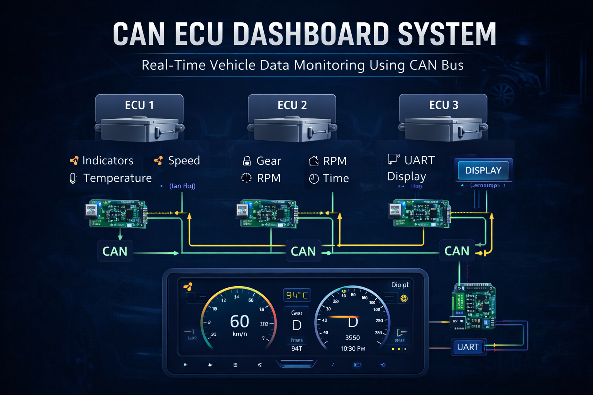

# 🚗 CAN ECU Dashboard System

---

##  CAN ECU Dashboard Architecture

  

  🔗 3 ECUs Connected via CAN Bus for Real-Time Dashboard System

---

## 📌 Overview

The **CAN ECU Dashboard System** is an embedded system project designed to monitor and display real-time vehicle parameters using the **Controller Area Network (CAN) protocol**.

This system reads data transmitted between multiple **Electronic Control Units (ECUs)** such as engine, transmission, and sensors, and displays meaningful information on a dashboard interface.

The project demonstrates how modern vehicles use CAN communication to share data efficiently using a **two-wire network (CAN High & CAN Low)** without requiring a central controller :contentReference[oaicite:0]{index=0}.

---

## 🎯 Objective

- Understand CAN protocol and ECU communication  
- Design a real-time vehicle dashboard system  
- Implement data acquisition from CAN bus  
- Display sensor values in a readable format  
- Build practical embedded system skills  

---

### Components:
- **ECU (Electronic Control Unit):** Generates vehicle data  
- **CAN Bus:** Communication medium  
- **Microcontroller:** Processes CAN messages  
- **Display Unit:** Shows real-time data  

---

## 🔍 What is CAN Bus?

The **Controller Area Network (CAN)** is a communication protocol used in vehicles to allow multiple ECUs to communicate over a shared two-wire system.

- No central controller required  
- Real-time data transmission  
- High reliability & noise resistance  
- Reduces wiring complexity   

Each ECU sends messages (frames), and other ECUs read only relevant data based on message IDs 

---

## ✨ Key Features

- 📡 Real-time CAN data monitoring  
- 🚗 Displays vehicle parameters (speed, RPM, temperature, etc.)  
- 🔄 Efficient communication using CAN protocol  
- ⚡ Fast and reliable data transfer  
- 🧠 Embedded system-based design  

---

## 🛠️ Technologies Used

- **Programming Language:** C  
- **Protocol:** CAN (Controller Area Network)  
- **Hardware:** Microcontroller / ECU Interface  
- **Concepts:**  
  - Embedded Systems  
  - Communication Protocols  
  - Real-Time Data Processing  

---

## 📂 Project Structure

CAN_ECU_Dashboard/
│
├── main.c # Entry point
├── can.c # CAN communication logic
├── display.c # Dashboard display logic
├── ecu.c # ECU data handling
├── can.h # CAN definitions
├── display.h # Display definitions
├── ecu.h # ECU interface
└── README.md # Documentation

---

## ⚙️ Working Principle

1. ECU generates sensor data (speed, temperature, etc.)  
2. Data is transmitted via CAN bus  
3. Microcontroller receives CAN frames  
4. Message ID is checked for relevance  
5. Data is extracted and processed  
6. Dashboard displays real-time information  

---
## ⚙️ System Description

This system consists of **three Electronic Control Units (ECUs)** connected via **CAN Bus** to build a real-time car dashboard.

### 🔹 ECU 1 – Sensor Monitoring
- Controls vehicle **indicators**
- Measures **speed**
- Monitors **temperature**

### 🔹 ECU 2 – Performance Monitoring
- Detects **gear position**
- Measures **RPM (engine speed)**
- Tracks **time**

### 🔹 ECU 3 – Display Unit
- Receives CAN data
- Sends data via **UART**
- Displays information on dashboard

---

# 🆔 CAN Message IDs

Parameter&CAN ID

Indicator-0x101

Speed-0x201

Temperature-0x301

Gear-0x401

RPM-0x501

Time-0x601

👉 IDs help the receiver understand what data is coming

---

# 🖥️ Sample Output (Tera Term)
Time-12:45:33 

Speed-45   

RPM-67  

Gear-G2  

Temp-30

Indicator-NoI

👉 This is your digital dashboard output

---

## 🔧 Skills

- C Programming  
- Embedded Systems  
- CAN Protocol  
- Real-Time Systems  
- Hardware Communication
  
 ---

## 💡 Applications

- Automotive dashboard systems  
- Vehicle diagnostics tools  
- Industrial automation systems  
- Embedded monitoring systems  
- Real-time data visualization  

---

## ⚠️ Limitations

- Requires CAN hardware interface  
- Limited UI (CLI / basic display)  
- Simulation may be required without real ECU  

---

## 📌 Conclusion

This project demonstrates how modern vehicles communicate internally using the **CAN protocol** and how embedded systems can be used to monitor and visualize this data in real time.

It provides hands-on experience in **automotive communication systems, embedded programming, and real-time data processing**, making it highly relevant for automotive and embedded domains.

---
